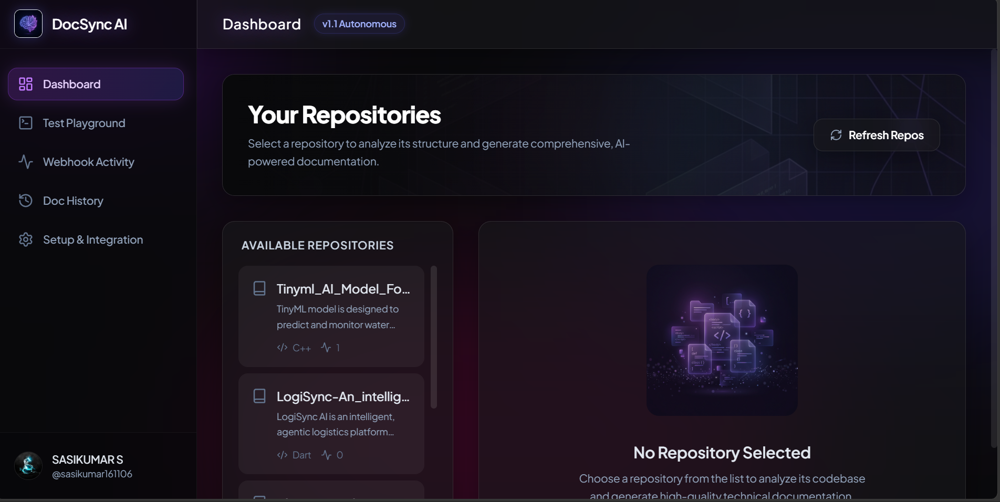
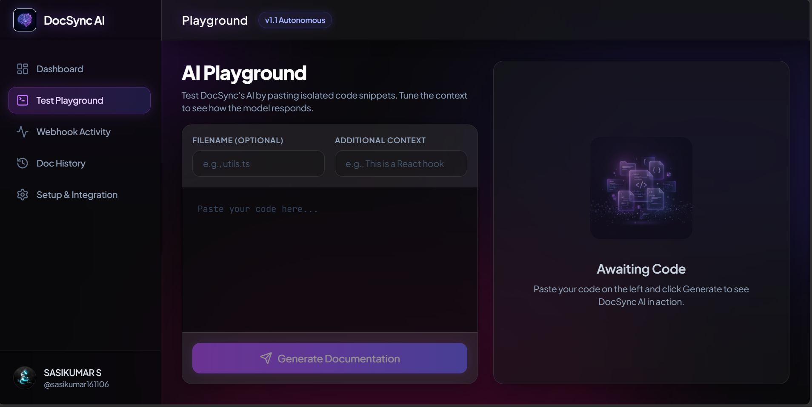
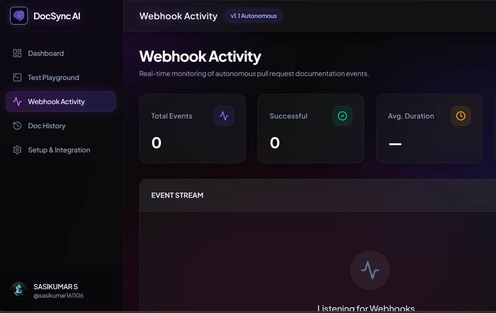

# 🤖 DocSync: Autonomous AI-Powered Technical Documentation Agent

DocSync is an autonomous AI agent that integrates seamlessly with GitHub to **automatically analyze code, generate comprehensive technical documentation, and inject it directly into developer workflows** — the moment a Pull Request is opened.

Built with a modern React frontend and a powerful Node.js/Express backend powered by Google's Gemini 2.5 Flash, DocSync eliminates the documentation bottleneck from your development cycle.

## 📸 Demo & Screenshots

### Video Walkthrough
<video src="https://github.com/sasikumar161106/DocSync_AI-powered_Technical_Documentation_Generator/raw/main/public/videos/docsync-demo.mp4" controls width="100%"></video>

### Dashboard


### Playground


### Webhook Activity


---

## ✨ Features

### 1. 🚀 Autonomous Pull Request Documentation

The flagship feature — DocSync acts as an **automated technical writer** that wakes up every time code changes.

- **Webhook Listener** — Listens for GitHub webhooks. When a developer opens or updates a Pull Request, the agent triggers automatically.
- **Intelligent Diff Analysis** — Fetches the raw code changes (diff) from the PR using the GitHub API.
- **Gemini Processing** — Sends the diff to Google's Gemini 2.5 Flash with a structured prompt, analyzing files changed, new additions, potential concerns, and documentation impact.
- **Automated PR Comments** — Posts a concise, bulleted Markdown summary directly on the Pull Request as a comment.

### 2. 📊 Webhook Activity Dashboard

A real-time monitoring panel built into the UI.

- **Live Stats Cards** — Total events, success rate, average processing duration, and total docs generated.
- **Event Feed** — Chronological log of every webhook event with color-coded status indicators (✅ success, ❌ failed, 🔄 processing, 👁 ignored).
- **Auto-Refresh** — Dashboard refreshes every 10 seconds with a live/paused toggle.
- **Direct Links** — Click through to view the generated comment on GitHub.

### 3. 📚 Documentation History

Browse and review all past AI-generated documentation.

- **Expandable Accordion** — Click any entry to reveal the full Markdown documentation inline.
- **PR Metadata** — Shows repository, PR number, title, author, and timestamp for each entry.
- **GitHub Links** — Jump directly to the comment on GitHub.

### 4. 📁 Project-Level Documentation Generation

Generate comprehensive overviews for entire repositories.

- **Repository Dashboard** — View and select your GitHub repositories from a modern UI.
- **Smart Filtering** — Automatically excludes `node_modules`, `dist`, lockfiles, images, and hidden files.
- **README Compilation** — Generates a project-wide `DOCSYNC.md` documenting structure, components, and setup.
- **One-Click Commit** — Push the generated file directly back to GitHub.

### 5. 🤖 Agentic Auto-Update System

The core agentic feature — DocSync **actively monitors** your repositories and autonomously keeps documentation up to date.

- **Autonomous Commit Tracking** — Polls GitHub every 30 seconds for new commits on the selected repository.
- **Change Detection** — Compares the latest commit SHA with the last known SHA to detect code changes.
- **Auto-Regeneration** — When a new commit is detected, it fetches all repo files, sends them to Gemini for analysis, and generates updated documentation.
- **Auto-Commit** — Pushes the regenerated `DOCSYNC.md` directly back to the repository without any human intervention.
- **Live Activity Log** — Every agent action (check, detect, generate, commit, skip, error) is logged in real-time with timestamps, SHA references, and clickable GitHub links.
- **Start/Stop Control** — Toggle the agent on or off from the Dashboard UI with a single click.

### 6. 🧪 Code Snippet Playground

A flexible testing ground for on-the-fly documentation.

- **Instant Analysis** — Paste code snippets and get structured Markdown documentation instantly.
- **Contextual Formatting** — Provide optional filename and context strings for tailored output.
- **One-Click Copy** — Copy the raw Markdown to your clipboard.

### 7. 🔒 Security & Reliability

Production-grade protections built into the webhook pipeline.

- **HMAC-SHA256 Signature Verification** — Validates the `X-Hub-Signature-256` header to ensure only GitHub can trigger your endpoint. Activated by setting `WEBHOOK_SECRET` in `.env`.
- **Rate Limiting** — 30 requests per minute per IP to prevent abuse.
- **Graceful Error Handling** — All failures are logged with context and duration for easy debugging.

### 8. 🎨 Premium Modern UI (Glassmorphism)

A fully overhauled, state-of-the-art interface built for developers.

- **Dark Mode by Default** — Deep, sleek backgrounds with subtle animated mesh gradients.
- **Glassmorphism Design** — Frosted glass (`backdrop-blur`) panels and soft neon glowing accents.
- **Framer Motion Animations** — Buttery smooth page transitions, staggered list load-ins, and responsive hover effects.
- **Inter Typography** — Clean, legible, and professional typography.

---

## 🏗️ Project Structure

```
DocSync_AI-powered_Technical_Documentation_Generator/
├── .env                   # Environment variables (API keys, secrets)
├── index.html             # Main HTML entry point
├── metadata.json          # Project metadata
├── package.json           # Dependencies and scripts
├── server.ts              # Backend: Express.js server + webhook system
├── tsconfig.json          # TypeScript configuration
├── vite.config.ts         # Vite build configuration
└── src/                   # Frontend source (React)
    ├── App.tsx            # Main app component, routing & sidebar navigation
    ├── index.css          # Tailwind CSS import
    ├── main.tsx           # React entry point
    ├── types.ts           # TypeScript type definitions
    └── components/
        ├── Dashboard.tsx        # GitHub repo analysis & doc generation
        ├── Playground.tsx       # Manual code snippet documentation
        ├── Settings.tsx         # Setup & integration guide
        ├── WebhookDashboard.tsx # Live webhook activity monitoring
        └── DocHistory.tsx       # Past documentation browser
```

### Backend Architecture (`server.ts`)

| Endpoint | Method | Description |
|----------|--------|-------------|
| `/api/docs/generate` | POST | Generate docs for a code snippet |
| `/api/docs/generate-repo` | POST | Generate project-level documentation |
| `/api/docs/auto-update` | POST | **Agentic auto-update**: detect new commits, regenerate docs, and push |
| `/api/github/user` | GET | Fetch authenticated GitHub user info |
| `/api/github/repos` | GET | List user's GitHub repositories |
| `/api/github/commit` | POST | Commit generated docs to a repository |
| `/api/github/repo-latest-sha` | GET | Fetch latest commit SHA for a repo |
| `/api/github/webhook` | POST | **GitHub webhook receiver** (autonomous trigger) |
| `/api/github/webhook/health` | GET | Webhook health check & config status |
| `/api/webhook/activity` | GET | Get webhook event activity log |
| `/api/webhook/history` | GET | Get documentation generation history |
| `/api/webhook/stats` | GET | Get aggregated webhook statistics |
| `/api/auto-update/log` | GET | Get agentic auto-update activity log |

---

## 🚀 Setup & Usage

### Prerequisites

- **Node.js** v18 or higher
- **Git**
- **Google Gemini API Key** — from [Google AI Studio](https://ai.google.dev/)
- **GitHub Personal Access Token** — with `repo` scope

### Installation

```bash
git clone https://github.com/sasikumar161106/DocSync_AI-powered_Technical_Documentation_Generator.git
cd DocSync_AI-powered_Technical_Documentation_Generator
npm install
```

### Configuration

Create a `.env` file in the project root:

```ini
# Required
GEMINI_API_KEY="YOUR_GEMINI_API_KEY"
GITHUB_TOKEN="ghp_your_github_personal_access_token"

# Optional — enables webhook signature verification
WEBHOOK_SECRET="your_webhook_secret_here"
```

- **`GEMINI_API_KEY`** — Get from [Google AI Studio](https://ai.google.dev/)
- **`GITHUB_TOKEN`** — GitHub → Settings → Developer Settings → Personal Access Tokens → Tokens (classic). Grant `repo` scope.
- **`WEBHOOK_SECRET`** — Any random string. Set the same value in your GitHub webhook settings for HMAC verification.

### Running Locally

```bash
npm run dev
```

Open `http://localhost:3000` in your browser.

### Setting Up Autonomous Webhooks

To enable the autonomous PR documentation feature:

1. **Expose your local server** using [ngrok](https://ngrok.com/):
   ```bash
   ngrok http 3000
   ```

2. **Configure the webhook** on your GitHub repository:
   - Go to **Settings → Webhooks → Add webhook**
   - **Payload URL:** `https://<your-ngrok-id>.ngrok-free.app/api/github/webhook`
   - **Content type:** `application/json`
   - **Secret:** *(optional)* Same value as your `WEBHOOK_SECRET`
   - **Events:** Select **only "Pull requests"**

3. **Test it** — Create a branch, push a change, and open a Pull Request. DocSync will automatically post an analysis comment.

### Deploying Live (Recommended)

To run DocSync 24/7 without needing your laptop or `ngrok`, you can deploy it to a free cloud host like **Render.com**.

1. Create an account on [Render](https://render.com/) and connect your GitHub.
2. Click **New +** -> **Web Service**.
3. Select your DocSync repository.
4. Configure the build:
   - **Root Directory:** `DocSync_AI-powered_Technical_Documentation_Generator` *(if the code is in this sub-folder)*
   - **Runtime:** `Node`
   - **Build Command:** `npm install && npm run build`
   - **Start Command:** `npm run start`
5. Scroll down to **Environment Variables** and add your secrets:
   - `GEMINI_API_KEY` = your API key
   - `GITHUB_TOKEN` = your GitHub token
   - `WEBHOOK_SECRET` = your custom secret password
6. Click **Create Web Service**.
7. Once deployed, take your new live URL (e.g., `https://docsync-agent.onrender.com`) and update your GitHub Webhook Payload URL!

### Using the Dashboard

| Tab | What it does |
|-----|-------------|
| **Dashboard** | Select a repo → Analyze → Generate docs → Commit `DOCSYNC.md` → **Start Auto-Update Agent** |
| **Test Playground** | Paste code → Get instant Markdown docs → Copy to clipboard |
| **Webhook Activity** | Live monitoring of all webhook events with stats |
| **Doc History** | Browse and review all past AI-generated documentation |
| **Setup & Integration** | In-app guide for GitHub token configuration |

---

## 🛠️ Technologies Used

| Layer | Stack |
|-------|-------|
| **Frontend** | React, TypeScript, Tailwind CSS, Vite |
| **Backend** | Node.js, Express.js, TypeScript |
| **AI Model** | Google Gemini 2.5 Flash (`@google/genai`) |
| **Security** | HMAC-SHA256 signature verification, rate limiting |
| **Rendering** | `react-markdown` |
| **Icons** | `lucide-react` |
| **Animations** | `motion` (Framer Motion) |

---

## 📄 License

This project is licensed under the [MIT License](LICENSE.md).